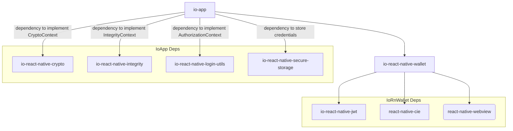

# 🪪 @pagopa/io-react-native-wallet

Library which provides a high level abstraction to interact with the IT-Wallet ecosystem via a predefined flows, a set of utilities and helpers.
Follows the [eudi-wallet-it-docs](https://github.com/italia/eudi-wallet-it-docs) specifications, currently aligned with version [0.7.1](https://github.com/italia/eudi-wallet-it-docs/releases/tag/0.7.1).

## Dependencies

- [@pagopa/io-react-native-jwt](https://github.com/pagopa/io-react-native-jwt) is used to manage JWT tokens;
- [@pagopa/react-native-cie](https://github.com/pagopa/io-cie-sdk) is used to manage CIE authentication;
- [react-native-webview](https://github.com/react-native-webview/react-native-webview) is used to manage the webview for the CIE authentication flow.

## Installation

```sh
# Install the required dependencies specified in the peerDependencies of the package.json

# Library
yarn install @pagopa/io-react-native-wallet
```

## Contexts

The library makes use of contexts to delegate certain aspects of the implementation to the application. Some of these aspects might greatly vary depending on the consumer application. This allows the library to be more flexible by not forcing the application to use a specific implementation and also to focus on the core functionalities.

Currently the library uses the following contexts:

<details>
  <summary>CryptoContext (cryptographic assets handling)</summary>

User flows implementions make use of tokens signed using asymmetric key pairs. Such cryptographic keys are managed by the device according to its specifications. It's not the intention of this package to handle such cryptographic assets and their peculiarities; instead, an handy interface is used to provide the right abstraction to allow responsibilities segregation:

- The application knows who to generate/store/delete keys;
- The package knows when and where to use them.

The interface is `CryptoContext` inherited from the `@pagopa/io-react-native-jwt` package:

The suggested library to manage cryptographic assets is [io-react-native-crypto](https://github.com/pagopa/io-react-native-crypto).

```ts
export interface CryptoContext {
  /**
   * Retrieves the public key to be used in this context.
   * MUST be the same key at every invocation.
   * @returns The public key to be used
   * @throws If no keys are found
   */
  getPublicKey: () => Promise<JWK>;
  /**
   * Produce a cryptographic signature for a given value.
   * The signature MUST be produced using the private key paired with the public retrieved by getPublicKey()
   * @param value The value to be signed
   * @returns The signature
   * @throws If no keys are found
   */
  getSignature: (value: string) => Promise<string>;
}
```

This package provides an helper to build a `CryptoContext` object bound to a given key tag

```ts
import { createCryptoContextFor } from "@pagopa/io-react-native-wallet";

const ctx = createCryptoContextFor("my-tag");
```

The

**Be sure the key for `my-tag` already exists.**

</details>

<details>
  <summary>IntegrityToken (device integrity)</summary>

In order to ensure the integrity of the device, the library asks the consumer application to provide a way to generate a token that can be used to verify the device integrity. This is done by providing an IntegrityToken object formed as follows:

```ts
/**
 * Interface for the integrity context which provides the necessary functions to interact with the integrity service.
 * The functions are platform specific and must be implemented in the platform specific code.
 * getHardwareKeyTag: returns the hardware key tag in a url safe format (e.g. base64url).
 * getAttestation: requests the attestation from the integrity service.
 * getHardwareSignatureWithAuthData: signs the clientData and returns the signature with the authenticator data.
 */
export interface IntegrityContext {
  getHardwareKeyTag: () => string;
  getAttestation: (nonce: string) => Promise<string>;
  getHardwareSignatureWithAuthData: (
    clientData: string
  ) => Promise<HardwareSignatureWithAuthData>;
}
```

Usually this is achieved by using [Google Play Integrity API](https://developer.android.com/google/play/integrity/overview) and [Key Attestation](https://developer.android.com/privacy-and-security/security-key-attestation) on Android, [DCAppAttestService](https://developer.apple.com/documentation/devicecheck/establishing-your-app-s-integrity) on iOS.

The suggested library to manage integrity is [io-react-native-integrity](https://github.com/pagopa/io-react-native-integrity).

</details>

<details>
  <summary>appFetch (making HTTP requests)</summary>

This package is compatibile with any http client which implements [Fetch API](https://developer.mozilla.org/en-US/docs/Web/API/Fetch_API). Functions that makes http requests allow for an optional `appFetch` parameter to provide a custom http client implementation. If not provided, the built-in implementation on the runtime is used.

</details>

### Flows

Different flows are provided to perform common operations. Each flow is a set of steps that must be executed in a given order. The documentation is provided inside the related folder:

- Wallet Instance
  - [Creation](./src/wallet-instance/README.md)
  - [Attestation](./src/wallet-instance-attestation/README.md)
- Credentail
  - [Issuance](./src/credential/issuance/README.md)
  - [Presentation](./src/credential/presentation/README.md) (TODO)
  - [Status](./src/credential/status/README.md)

### Example

An example app is provided in [example](./example) folder which demostrates how to implemente these flows. To run it, follow the instructions in the [README](./example/README.md).

### Ecosystem

`io-react-native-wallet` is designed to be used in [io-app](https://github.com/pagopa/io-app) and its ecosystem. There are a few libraries that can be used to implement the context required to implement the flows defined by this package.
Below there's a list of the libraries and a schema of how they interact with each other:

- [@pagopa/io-react-native-crypto](https://github.com/pagopa/io-react-native-crypto) - Used to manage cryptographic keys and signatures
- [@pagopa/io-react-native-integrity](https://github.com/pagopa/io-react-native-integrity) - Used to manage and verify the integrity of the device
- [@pagopa/io-react-native-login-utils](https://github.com/pagopa/io-react-native-login-utils) - Used to manage strong authentication flows securely
- [@pagopa/io-react-native-secure-storage](https://github.com/pagopa/io-react-native-secure-storage) - Used to store data securely on the device


