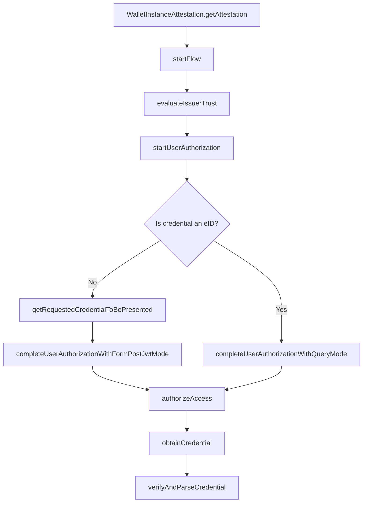

# Credential Issuance

This flow is used to obtain a credential from a credential issuer. Each step in the flow is imported from the related file which is named with a sequential number.

There's a fork in the flow which is based on the type of the credential that is being requested. If the credential is an eID, the flow takes a different path than if it is not an eID.
This is due to the fact that eID credentials require a different authorization flow than other credentials, which is accomplished by a strong authentication method like SPID or CIE.
Credentials instead require a simpler authorization flow and they require other credentials to be presented in order to be issued.

The supported credentials are defined in the entity configuration of the issuer which is evaluted and parsed in the `evaluateIssuerTrust` step.

## Sequence Diagram



## Mapped results

### 404 Not Found (CredentialNotEntitledError)

A `404 Not Found` response is returned by the credential issuer when the authenticated user is not entitled to receive the requested credential.

## Strong authentication for eID issuance (Query Mode)

The eID issuance requires a strong authentication method. Currently SPID (L2), CieID (L2) and CIE+PIN (L3) are supported. The strong authentication method is determined by the IDP hint which is passed to the `completeUserAuthorizationWithQueryMode` function.

For SPID in production the IDP hint can be found [here](https://registry.spid.gov.it/identity-providers), under the `entityId` field. For pre-production environment the IDP hint is `https://demo.spid.gov.it'`.

For CieID(L2) the IDP hint is `https://idserver.servizicie.interno.gov.it/idp/profile/SAML2/POST/SSO"` for production and `https://collaudo.idserver.servizicie.interno.gov.it/idp/profile/SAML2/POST/SSO` for pre-production.

CIE+PIN(L3) requires a different flow due to the physical card presence. Helper functions are exposed to handle it and the documentation can be found [here](../../cie/README.md).

The expected result from the authentication process is in provided in the query string as defined in the [JWT Secured Authorization Response Mode for OAuth 2.0 (JARM)](https://openid.net/specs/oauth-v2-jarm.html#name-response-mode-queryjwt).

## Authentication through credentials (Form Post JWT Mode)

When the credential is different than an eID, the flow requires the user to present other credentials in order to obtain the requested one. This is done through the `getRequestedCredentialToBePresented` followed by the `completeUserAuthorizationWithFormPostJwtMode`.

The expected result from the authentication process is in `form_post.jwt` format as defined in [JWT Secured Authorization Response Mode for OAuth 2.0 (JARM)](https://openid.net/specs/oauth-v2-jarm.html#name-response-mode-form_postjwt).

## Examples

<details>
  <summary>Credential issuance flow</summary>

```ts
// Retrieve the integrity key tag from the store and create its context
const integrityKeyTag = "example"; // Let's assume this is the key tag used to create the wallet instance
const integrityContext = getIntegrityContext(integrityKeyTag);

// generate Key for Wallet Instance Attestation
// ensure the key esists befor starting the issuing process
await regenerateCryptoKey(WIA_KEYTAG); // Let's assume this function regenerates this ephemeral key
const wiaCryptoContext = createCryptoContextFor(WIA_KEYTAG);

const { WALLET_PROVIDER_BASE_URL, WALLET_EAA_PROVIDER_BASE_URL, REDIRECT_URI } =
  env; // Let's assume these are the environment variables

/**
 * Obtains a new Wallet Instance Attestation.
 * WARNING: The integrity context must be the same used when creating the Wallet Instance with the same keytag.
 */
const walletInstanceAttestation =
  await WalletInstanceAttestation.getAttestation({
    wiaCryptoContext,
    integrityContext,
    walletProviderBaseUrl: WALLET_PROVIDER_BASE_URL,
    appFetch,
  });

const credentialType = "someCredential"; // Let's assume this is the credential type

const eid = {
  credential: "example",
  parsedCredential: "example"
  keyTag: "example";
  credentialType: "eid";
};

const eidCryptoContext = createCryptoContextFor(eid.keyTag);

// Create credential crypto context
const credentialKeyTag = uuid.v4().toString();
await generate(credentialKeyTag); // Let's assume this function generates a new hardware-backed key pair
const credentialCryptoContext = createCryptoContextFor(credentialKeyTag);

// Start the issuance flow
const startFlow: Credential.Issuance.StartFlow = () => ({
  issuerUrl: WALLET_EAA_PROVIDER_BASE_URL,
  credentialType,
});

const { issuerUrl } = startFlow();

// Evaluate issuer trust
const { issuerConf } = await Credential.Issuance.evaluateIssuerTrust(issuerUrl);

// Start user authorization
const { issuerRequestUri, clientId, codeVerifier, credentialDefinition } =
  await Credential.Issuance.startUserAuthorization(issuerConf, credentialType, {
    walletInstanceAttestation,
    redirectUri,
    wiaCryptoContext,
    appFetch,
  });

const requestObject =
  await Credential.Issuance.getRequestedCredentialToBePresented(
    issuerRequestUri,
    clientId,
    issuerConf,
    appFetch
  );

// The app here should ask the user to confirm the required data contained in the requestObject

// Complete the user authorization via form_post.jwt mode
const { code } =
  await Credential.Issuance.completeUserAuthorizationWithFormPostJwtMode(
    requestObject,
    { wiaCryptoContext, pidCryptoContext, pid, walletInstanceAttestation }
  );

// Generate the DPoP context which will be used for the whole issuance flow
await regenerateCryptoKey(DPOP_KEYTAG); // Let's assume this function regenerates this ephemeral key for the DPoP
const dPopCryptoContext = createCryptoContextFor(DPOP_KEYTAG);

const { accessToken } = await Credential.Issuance.authorizeAccess(
  issuerConf,
  code,
  clientId,
  redirectUri,
  codeVerifier,
  {
    walletInstanceAttestation,
    wiaCryptoContext,
    dPopCryptoContext,
    appFetch,
  }
);

// Obtain the credential
const { credential, format } = await Credential.Issuance.obtainCredential(
  issuerConf,
  accessToken,
  clientId,
  credentialDefinition,
  {
    credentialCryptoContext,
    dPopCryptoContext,
    appFetch,
  }
);

// Parse and verify the credential. The ignoreMissingAttributes flag must be set to false or omitted in production.
const { parsedCredential } = await Credential.Issuance.verifyAndParseCredential(
  issuerConf,
  credential,
  format,
  { credentialCryptoContext, ignoreMissingAttributes: true }
);

return {
  parsedCredential,
  credential,
  keyTag: credentialKeyTag,
  credentialType,
};
```

</details>

<details>
  <summary>eID issuance flow</summary>

```ts
// Retrieve the integrity key tag from the store and create its context
const integrityKeyTag = "example"; // Let's assume this is the key tag used to create the wallet instance
const integrityContext = getIntegrityContext(integrityKeyTag);

// generate Key for Wallet Instance Attestation
// ensure the key esists befor starting the issuing process
await regenerateCryptoKey(WIA_KEYTAG); // Let's assume this function regenerates this ephemeral key
const wiaCryptoContext = createCryptoContextFor(WIA_KEYTAG);

const { WALLET_PROVIDER_BASE_URL, WALLET_EID_PROVIDER_BASE_URL, REDIRECT_URI } =
  env; // Let's assume these are the environment variables

/**
 * Obtains a new Wallet Instance Attestation.
 * WARNING: The integrity context must be the same used when creating the Wallet Instance with the same keytag.
 */
const walletInstanceAttestation =
  await WalletInstanceAttestation.getAttestation({
    wiaCryptoContext,
    integrityContext,
    walletProviderBaseUrl: WALLET_PROVIDER_BASE_URL,
    appFetch,
  });

const idpHit = "https://example.com"; // Let's assume this is the IDP hint

const authorizationContext = idpHint.includes("servizicie")
  ? undefined
  : {
      authorize: openAuthenticationSession, // Let's assume this function opens the browser for the user to authenticate
    };
/*
 * Create credential crypto context for the PID
 * WARNING: The eID keytag must be persisted and later used when requesting a credential which requires a eID presentation
 */
const credentialKeyTag = uuid.v4().toString();
await generate(credentialKeyTag);
const credentialCryptoContext = createCryptoContextFor(credentialKeyTag);

// Start the issuance flow
const startFlow: Credential.Issuance.StartFlow = () => ({
  issuerUrl: WALLET_EID_PROVIDER_BASE_URL,
  credentialType: "PersonIdentificationData",
  appFetch,
});

const { issuerUrl } = startFlow();

// Evaluate issuer trust
const { issuerConf } = await Credential.Issuance.evaluateIssuerTrust(
  issuerUrl,
  { appFetch }
);

// Start user authorization
const { issuerRequestUri, clientId, codeVerifier, credentialDefinition } =
  await Credential.Issuance.startUserAuthorization(issuerConf, credentialType, {
    walletInstanceAttestation,
    redirectUri,
    wiaCryptoContext,
    appFetch,
  });

// Complete the authroization process with query mode with the authorizationContext which opens the browser
const { code } =
  await Credential.Issuance.completeUserAuthorizationWithQueryMode(
    issuerRequestUri,
    clientId,
    issuerConf,
    idpHint,
    redirectUri,
    authorizationContext
  );

// Create DPoP context which will be used for the whole issuance flow
await regenerateCryptoKey(DPOP_KEYTAG);
const dPopCryptoContext = createCryptoContextFor(DPOP_KEYTAG);

const { accessToken } = await Credential.Issuance.authorizeAccess(
  issuerConf,
  code,
  clientId,
  redirectUri,
  codeVerifier,
  {
    walletInstanceAttestation,
    wiaCryptoContext,
    dPopCryptoContext,
    appFetch,
  }
);

// Obtain che eID credential
const { credential, format } = await Credential.Issuance.obtainCredential(
  issuerConf,
  accessToken,
  clientId,
  credentialDefinition,
  {
    credentialCryptoContext,
    dPopCryptoContext,
    appFetch,
  }
);

// Parse and verify the eID credential
const { parsedCredential } = await Credential.Issuance.verifyAndParseCredential(
  issuerConf,
  credential,
  format,
  { credentialCryptoContext }
);

return {
  parsedCredential,
  credential,
  keyTag: credentialKeyTag,
  credentialType,
};
```

The result of this flow is a row credential and a parsed credential which must be stored securely in the wallet along with its crypto key.

</details>
