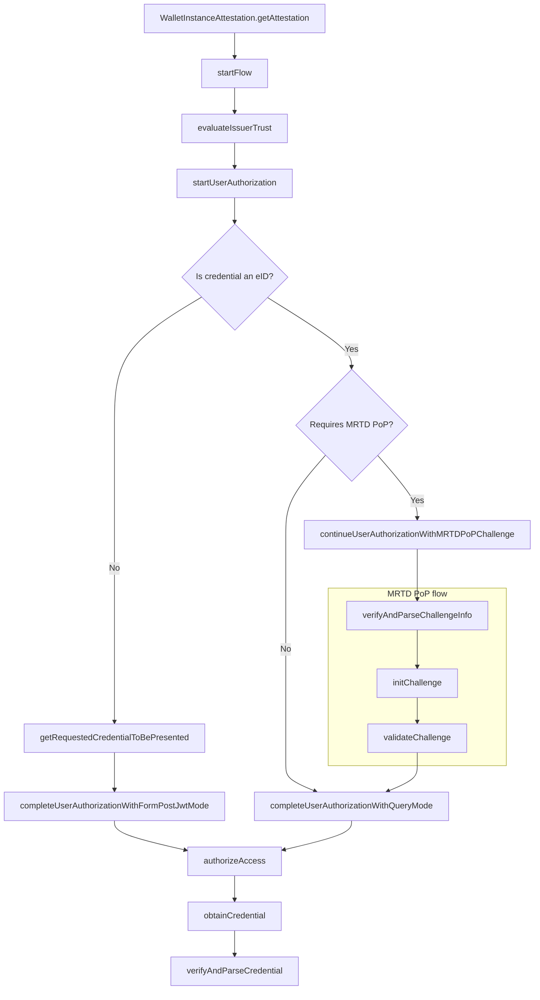

# Credential Issuance

This flow is used to obtain a credential from a credential issuer. Each step in the flow is imported from the related file which is named with a sequential number.

There's a fork in the flow which is based on the type of the credential that is being requested. If the credential is an eID, the flow takes a different path than if it is not an eID.
This is due to the fact that eID credentials require a different authorization flow than other credentials, which is accomplished by a strong authentication method like SPID or CIE.
Credentials instead require a simpler authorization flow and they require other credentials to be presented in order to be issued.

The supported credentials are defined in the entity configuration of the issuer which is evaluted and parsed in the `evaluateIssuerTrust` step. Available credentials are identified with a unique `credential_configuration_id`, that must be used when requesting authorization. The Authorization Server returns an array of **credential identifiers** that map to the `credential_configuration_id` provided: to obtain the credential, one of the credential identifiers (or all of them) must be requested to the credential endpoint.

## Sequence Diagram



## Mapped results

The following errors are mapped to a `IssuerResponseError` with specific codes.

| HTTP Status     | Error Code                               | Description                                                                                                                                                                                                                                                                                                                                                                                                                                                                                           |
| --------------- | ---------------------------------------- | ----------------------------------------------------------------------------------------------------------------------------------------------------------------------------------------------------------------------------------------------------------------------------------------------------------------------------------------------------------------------------------------------------------------------------------------------------------------------------------------------------- |
| `201 Created`   | `ERR_CREDENTIAL_ISSUING_NOT_SYNCHRONOUS` | This response is returned by the credential issuer when the request has been queued because the credential cannot be issued synchronously. The consumer should try to obtain the credential at a later time. Although `201 Created` is not considered an error, it is mapped as an error in this context in order to handle the case where the credential issuance is not synchronous. This allows keeping the flow consistent and handle the case where the credential is not immediately available. |
| `403 Forbidden` | `ERR_CREDENTIAL_INVALID_STATUS`          | This response is returned by the credential issuer when the requested credential has an invalid status. It might contain more details in the `reason` property.                                                                                                                                                                                                                                                                                                                                       |
| `404 Not Found` | `ERR_CREDENTIAL_INVALID_STATUS`          | This response is returned by the credential issuer when the authenticated user is not entitled to receive the requested credential. It might contain more details in the `reason` property.                                                                                                                                                                                                                                                                                                           |
| `*`             | `ERR_ISSUER_GENERIC_ERROR`               | This is a generic error code to map unexpected errors that occurred when interacting with the Issuer.                                                                                                                                                                                                                                                                                                                                                                                                 |

## Strong authentication for eID issuance (Query Mode)

The eID issuance requires a strong authentication method. Currently SPID (L2), CieID (L2) and CIE+PIN (L3) are supported. The strong authentication method is determined by the IDP hint which is passed to the `completeUserAuthorizationWithQueryMode` function.

For SPID in production the IDP hint can be found [here](https://registry.spid.gov.it/identity-providers), under the `entityId` field. For pre-production environment the IDP hint is `https://demo.spid.gov.it'`.

For CieID(L2) the IDP hint is `https://idserver.servizicie.interno.gov.it/idp/profile/SAML2/POST/SSO"` for production and `https://collaudo.idserver.servizicie.interno.gov.it/idp/profile/SAML2/POST/SSO` for pre-production.

CIE+PIN(L3) requires a different flow due to the physical card presence. Helper functions are exposed to handle it and the documentation can be found [here](../../cie/README.md).

The expected result from the authentication process is in provided in the query string as defined in the [JWT Secured Authorization Response Mode for OAuth 2.0 (JARM)](https://openid.net/specs/oauth-v2-jarm.html#name-response-mode-queryjwt).

#### eID Substantial Authentication (L2+) with MRTD Verification

MRTD Verification is a sub-flow of the Issuance flow and is used when the requested eID requires **eID Substantial Authentication (LoA3) with MRTD (Machine Readable Travel Document) Verification**. This method provides an alternative to CIEid LoA High authentication, requiring two distinct steps to complete the authorization:

1. **Primary Authentication**: LoA3 electronic identification (SPID or CIEid L2).
2. **MRTD Proof of Possession (PoP)**: Electronic document reading and cryptographic verification.

This process is initiated by the Authorization Server responding to the primary authentication step with a redirect that includes a challenge in the query string, which is handled by the `continueUserAuthorizationWithMRTDPoPChallenge` function. Once the MRTD PoP is completed, the user must continue the PID issuance flow with the `completeUserAuthorizationWithQueryMode` function.

Complete documentation for the MRTD PoP flow can be found here: [mrtd-pop](./mrtd-pop/README.md)

## Authentication through credentials (Form Post JWT Mode)

When the credential is different than an eID, the flow requires the user to present other credentials in order to obtain the requested one. This is done through the `getRequestedCredentialToBePresented` followed by the `completeUserAuthorizationWithFormPostJwtMode`.

The expected result from the authentication process is in `form_post.jwt` format as defined in [JWT Secured Authorization Response Mode for OAuth 2.0 (JARM)](https://openid.net/specs/oauth-v2-jarm.html#name-response-mode-form_postjwt).

## Examples

<details>
  <summary>Credential issuance flow</summary>

```ts
import { IoWallet } from "@pagopa/io-react-native-wallet";

const wallet = new IoWallet({ version: "1.0.0" });

// Retrieve the integrity key tag from the store and create its context
const integrityKeyTag = "example"; // Let's assume this is the key tag used to create the wallet instance
const integrityContext = getIntegrityContext(integrityKeyTag);

// generate Key for Wallet Instance Attestation
// ensure the key esists befor starting the issuing process
await regenerateCryptoKey(WIA_KEYTAG); // Let's assume this function regenerates this ephemeral key
const wiaCryptoContext = createCryptoContextFor(WIA_KEYTAG);

const { WALLET_PROVIDER_BASE_URL, WALLET_EAA_PROVIDER_BASE_URL, REDIRECT_URI } =
  env; // Let's assume these are the environment variables

/**
 * Obtains a new Wallet Instance Attestation.
 * WARNING: The integrity context must be the same used when creating the Wallet Instance with the same keytag.
 */
const walletInstanceAttestation =
  await WalletInstanceAttestation.getAttestation({
    wiaCryptoContext,
    integrityContext,
    walletProviderBaseUrl: WALLET_PROVIDER_BASE_URL,
    appFetch,
  });

const pid = {
  credential: "example",
  parsedCredential: "example"
  keyTag: "example";
  credentialType: "PersonIdentificationData";
};

// Create credential crypto context
const credentialKeyTag = uuidv4().toString();
await generate(credentialKeyTag); // Let's assume this function generates a new hardware-backed key pair
const credentialCryptoContext = createCryptoContextFor(credentialKeyTag);

// Evaluate issuer trust
const { issuerConf } = await wallet.CredentialIssuance.evaluateIssuerTrust(WALLET_EAA_PROVIDER_BASE_URL);

// Start user authorization
const { issuerRequestUri, clientId, codeVerifier } =
  await wallet.CredentialIssuance.startUserAuthorization(
    issuerConf,
    ["someCredentialId"],
    { proofType: "none" },
    {
      walletInstanceAttestation,
      redirectUri: REDIRECT_URI,
      wiaCryptoContext,
      appFetch,
    }
  );

const requestObject =
  await wallet.CredentialIssuance.getRequestedCredentialToBePresented(
    issuerRequestUri,
    clientId,
    issuerConf,
    appFetch
  );

// Complete the user authorization via form_post.jwt mode
const { code } =
  await wallet.CredentialIssuance.completeUserAuthorizationWithFormPostJwtMode(
    requestObject,
    pid.credential,
    { wiaCryptoContext, pidCryptoContext: createCryptoContextFor(pid.keyTag) }
  );

// Generate the DPoP context which will be used for the whole issuance flow
await regenerateCryptoKey(DPOP_KEYTAG); // Let's assume this function regenerates this ephemeral key for the DPoP
const dPopCryptoContext = createCryptoContextFor(DPOP_KEYTAG);

const { accessToken } = await wallet.CredentialIssuance.authorizeAccess(
  issuerConf,
  code,
  clientId,
  redirectUri: REDIRECT_URI,
  codeVerifier,
  {
    walletInstanceAttestation,
    wiaCryptoContext,
    dPopCryptoContext,
    appFetch,
  }
);

// For simplicity, in this example flow we work on a single credential.
const { credential_configuration_id, credential_identifiers } =
    accessToken.authorization_details[0]!;

 // Obtain the credential
const { credential, format } = await wallet.CredentialIssuance.obtainCredential(
  issuerConf,
  accessToken,
  clientId,
  {
    credential_configuration_id,
    credential_identifier: credential_identifiers[0],
  },
  {
    credentialCryptoContext,
    dPopCryptoContext,
    appFetch,
  }
);

// The certificate below is required to perform the `x5chain` validation of credentials in `mdoc` format.
// In a real-world scenario, it must be obtained from the appropriate endpoint exposed by the Trust Anchor
const mockX509CertRoot = format === "mso_mdoc" ? "base64encodedX509CertRoot" : undefined

/*
 * Parse and verify the credential. The ignoreMissingAttributes flag must be set to false or omitted in production.
 * WARNING: includeUndefinedAttributes should not be set to true in production in order to get only claims explicitly declared by the issuer.
 */
const { parsedCredential } =
  await wallet.CredentialIssuance.verifyAndParseCredential(
    issuerConf,
    credential,
    credential_configuration_id,
    {
      credentialCryptoContext,
      ignoreMissingAttributes: true,
      includeUndefinedAttributes: false
    },
    mockX509CertRoot
  );

const credentialType =
  issuerConf.openid_credential_issuer.credential_configurations_supported[
    credential_configuration_id
  ].scope;

return {
  parsedCredential,
  credential,
  keyTag: credentialKeyTag,
  credentialType,
  credentialConfigurationId: credential_configuration_id,
};
```

</details>

<details>
  <summary>eID issuance flow</summary>

```ts
import { IoWallet } from "@pagopa/io-react-native-wallet";

const wallet = new IoWallet({ version: "1.0.0" });

// Retrieve the integrity key tag from the store and create its context
const integrityKeyTag = "example"; // Let's assume this is the key tag used to create the wallet instance
const integrityContext = getIntegrityContext(integrityKeyTag);

// generate Key for Wallet Instance Attestation
// ensure the key esists befor starting the issuing process
await regenerateCryptoKey(WIA_KEYTAG); // Let's assume this function regenerates this ephemeral key
const wiaCryptoContext = createCryptoContextFor(WIA_KEYTAG);

const { WALLET_PROVIDER_BASE_URL, WALLET_EID_PROVIDER_BASE_URL, REDIRECT_URI } =
  env; // Let's assume these are the environment variables

/**
 * Obtains a new Wallet Instance Attestation.
 * WARNING: The integrity context must be the same used when creating the Wallet Instance with the same keytag.
 */
const walletInstanceAttestation =
  await WalletInstanceAttestation.getAttestation({
    wiaCryptoContext,
    integrityContext,
    walletProviderBaseUrl: WALLET_PROVIDER_BASE_URL,
    appFetch,
  });

const idpHit = "https://example.com"; // Let's assume this is the IDP hint

const authorizationContext = idpHint.includes("servizicie")
  ? undefined
  : {
      authorize: openAuthenticationSession, // Let's assume this function opens the browser for the user to authenticate
    };
/*
 * Create credential crypto context for the PID
 * WARNING: The eID keytag must be persisted and later used when requesting a credential which requires a eID presentation
 */
const credentialKeyTag = uuidv4().toString();
await generate(credentialKeyTag);
const credentialCryptoContext = createCryptoContextFor(credentialKeyTag);

// Evaluate issuer trust
const { issuerConf } = await wallet.CredentialIssuance.evaluateIssuerTrust(
  WALLET_EID_PROVIDER_BASE_URL,
  { appFetch }
);

// Start user authorization
const { issuerRequestUri, clientId, codeVerifier, credentialDefinition } =
  await wallet.CredentialIssuance.startUserAuthorization(
    issuerConf,
    ["dc_sd_jwt_PersonIdentificationData"], // Request authorization for one or more credentials
    { proofType: "none" },
    {
      walletInstanceAttestation,
      redirectUri,
      wiaCryptoContext,
      appFetch,
    }
  );

// Complete the authorization process with query mode with the authorizationContext which opens the browser
const { code } =
  await wallet.CredentialIssuance.completeUserAuthorizationWithQueryMode(
    issuerRequestUri
  );

// Create DPoP context which will be used for the whole issuance flow
await regenerateCryptoKey(DPOP_KEYTAG);
const dPopCryptoContext = createCryptoContextFor(DPOP_KEYTAG);

const { accessToken } = await wallet.CredentialIssuance.authorizeAccess(
  issuerConf,
  code,
  clientId,
  redirectUri,
  codeVerifier,
  {
    walletInstanceAttestation,
    wiaCryptoContext,
    dPopCryptoContext,
    appFetch,
  }
);


const [pidCredentialDefinition] = credentialDefinition;

// Extract the credential_identifier(s) from the access token
// For each one of them, a credential can be obtained by calling `obtainCredential`
const { credential_configuration_id, credential_identifiers } =
    accessToken.authorization_details.find(
      (authDetails) =>
        authDetails.credential_configuration_id ===
        pidCredentialDefinition.credential_configuration_id
    );

// Obtain che eID credential
const { credential, format } = await wallet.CredentialIssuance.obtainCredential(
  issuerConf,
  accessToken,
  clientId,
  {
    credential_configuration_id,
    credential_identifier: credential_identifiers.at(0),
  },
  {
    credentialCryptoContext,
    dPopCryptoContext,
    appFetch,
  }
);

// Parse and verify the eID credential
const { parsedCredential, issuedAt, expiration } = await wallet.CredentialIssuance.verifyAndParseCredential(
  issuerConf,
  credential,
  credential_configuration_id,
  { credentialCryptoContext }
);

return {
  parsedCredential,
  credential,
  credentialConfigurationId: credential_configuration_id
  credentialType: "PersonIdentificationData",
  keyTag: credentialKeyTag,
  issuedAt,
  expiration
};
```

The result of this flow is a raw credential and a parsed credential which must be stored securely in the wallet along with its crypto key.

</details>

<details>
  <summary>eID issuance flow with MRTD PoP validation</summary>

```ts
import { IoWallet } from "@pagopa/io-react-native-wallet";

const wallet = new IoWallet({ version: "1.0.0" });

/**
 *
 * Previous steps are the sames as the "eID issuance flow" example
 *
 */

// Start user authorization indicating "mrtd-pop" as the proof type with the idpHint of the
// chosen identification method
const { issuerRequestUri, clientId, codeVerifier, credentialDefinition } =
  await wallet.CredentialIssuance.startUserAuthorization(
    issuerConf,
    [credentialId],
    { proofType: "mrtd-pop", idpHinting: idpHint },
    {
      walletInstanceAttestation,
      redirectUri: redirectUri,
      wiaCryptoContext,
      appFetch,
    }
  );

// Obtain the Authorization URL
const { authUrl } = await wallet.CredentialIssuance.buildAuthorizationUrl(
  issuerRequestUri,
  clientId,
  issuerConf,
  idpHint
);

// Extract challenge info from the Authorization URL
const { challenge_info } =
  await wallet.CredentialIssuance.continueUserAuthorizationWithMRTDPoPChallenge(
    authUrl
  );

// Verify and parse challenge info and extract challenge data: initialization url, session and nonce
const {
  htu: initUrl,
  mrtd_auth_session,
  mrtd_pop_jwt_nonce,
} = await wallet.CredentialIssuance.MRTDPoP.verifyAndParseChallengeInfo(
  issuerConf,
  challenge_info,
  { wiaCryptoContext }
);

// Initialize challenge and obtain the challenge text to sign the CIE PACE protocol and validation url
const {
  htu: validationUrl,
  challenge,
  mrtd_pop_nonce,
} = await wallet.CredentialIssuance.MRTDPoP.initChallenge(
  issuerConf,
  initUrl,
  mrtd_auth_session,
  mrtd_pop_jwt_nonce,
  {
    walletInstanceAttestation,
    wiaCryptoContext,
    appFetch,
  }
);

// CIE cryptographic interaction: you need to sign the challenge with the CIE through NFC interaction
const { nis, mrtds } = /* NFC interactions functions */

// Validate challenge
const { mrtd_val_pop_nonce, redirect_uri } =
  await wallet.CredentialIssuance.MRTDPoP.validateChallenge(
    issuerConf,
    validationUrl,
    mrtd_auth_session,
    mrtd_pop_nonce,
    mrtd,
    ias,
    {
      walletInstanceAttestation,
      wiaCryptoContext,
      appFetch,
    }
  );

// Build the callback url
const { callbackUrl } = await wallet.CredentialIssuance.buildChallengeCallbackUrl(
  redirect_uri,
  mrtd_val_pop_nonce,
  mrtd_auth_session
);

// The generated authUrl must be used to open a browser or webview capable of catching the redirectSchema to perform a get request to the authorization endpoint.
const authRedirectUrl = /* From a browser or webview redirect */

// Complete the authorization process with query mode using the returned callback url
const { code } =
  await wallet.CredentialIssuance.completeUserAuthorizationWithQueryMode(
    authRedirectUrl
  );

/**
 *
 * The next steps are the same as the "eID issuance flow" example
 *
 */
```

The result of this flow is a raw credential and a parsed credential which must be stored securely in the wallet along with its crypto key.

</details>
