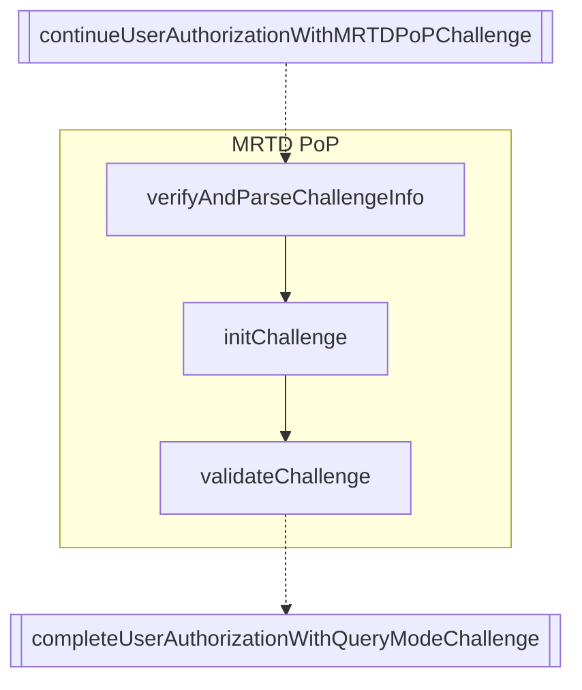

# MRTD PoP flow

**MRTD-PoP (Machine Readable Travel Document - Proof of Possession)** flow for the IO Wallet, following the [eID Wallet L2+ Credential Issuance specification](https://italia.github.io/eid-wallet-it-docs/versione-corrente/en/credential-issuance-l2plus.html).

The MRTD-PoP flow is used to prove possession of an MRTD (such as a CIE) during the issuance of high-assurance credentials. The process involves a challenge-response protocol between the wallet and the issuer, leveraging JWTs and cryptographic attestation.

This flow is part of the [PID issuance flow](../README.md) and must be started after the `continueUserAuthorizationWithMRTDPoPChallenge` function. Once MRTD PoP is completed, the PID issuance flow must continue with the `completeUserAuthorizationWithQueryMode` function with the authorization url obtained from the validation.

> **⚠️ Important**: The entire flow must be initiated and concluded within the same web context (e.g., the same WebView instance) to maintain session continuity. Using different contexts (such as switching between an external browser and a WebView) will result in session loss and authentication failures due to cookie/session mismatch (JSESSIONID).

## Sequence Diagram



## Example

```typescript
// Verify and parse challenge info and extract challenge data: initialization url, session and nonce
const {
  htu: initUrl,
  mrtd_auth_session,
  mrtd_pop_jwt_nonce,
} = await Credential.Issuance.MRTDPoP.verifyAndParseChallengeInfo(
  issuerConf,
  challenge_info,
  { wiaCryptoContext }
);

// Initialize challenge and obtain the challenge text to sign the CIE PACE protocol and validation url
const {
  htu: validationUrl,
  challenge,
  mrtd_pop_nonce,
} = await Credential.Issuance.MRTDPoP.initChallenge(
  issuerConf,
  initUrl,
  mrtd_auth_session,
  mrtd_pop_jwt_nonce,
  {
    walletInstanceAttestation,
    wiaCryptoContext,
    appFetch,
  }
);

// CIE cryptographic interaction: you need to sign the challenge with the CIE through NFC interaction
const { nis, mrtds } = /* NFC interactions functions */

// Validate challenge
const { mrtd_val_pop_nonce, redirect_uri } =
  await Credential.Issuance.MRTDPoP.validateChallenge(
    issuerConf,
    validationUrl,
    mrtd_auth_session,
    mrtd_pop_nonce,
    mrtd,
    ias,
    {
      walletInstanceAttestation,
      wiaCryptoContext,
      appFetch,
    }
  );

// Build the callback url
const { callbackUrl } = await Credential.Issuance.buildChallengeCallbackUrl(
  redirect_uri,
  mrtd_val_pop_nonce,
  mrtd_auth_session
);

// The generated authUrl must be used to open a browser or webview capable of catching the redirectSchema to perform a get request to the authorization endpoint.
const authRedirectUrl = /* From a browser or webview redirect */

// Use the authRedirectUrl to continue the PID issuance flow
```
