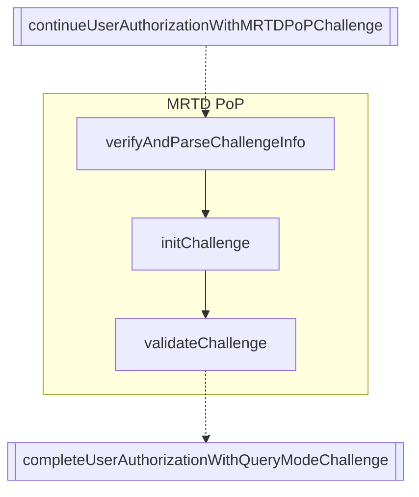

# MRTD PoP flow

**MRTD-PoP (Machine Readable Travel Document - Proof of Possession)** flow for the IO Wallet, following the [eID Wallet L2+ Credential Issuance specification](https://italia.github.io/eid-wallet-it-docs/versione-corrente/en/credential-issuance-l2plus.html).

The MRTD-PoP flow is used to prove possession of an MRTD (such as a CIE) during the issuance of high-assurance credentials. The process involves a challenge-response protocol between the wallet and the issuer, leveraging JWTs and cryptographic attestation.

This flow is part of the [PID issuance flow](../README.md) and must be started after the `continueUserAuthorizationWithMRTDPoPChallenge` function. Once MRTD PoP is completed, the PID issuance can continue with the `authorizeAccess` function with the data obtained with the challenge validation.

## Sequence Diagram



## Example

```typescript
import {
  verifyAndParseChallengeInfo,
  initChallenge,
  validateChallenge,
} from "./mrtd-pop";
import type { MrtdPayload, IasPayload } from "./mrtd-pop/types";

// 1. Verify and parse the challenge info JWT received from the issuer
const challengeInfo = await verifyAndParseChallengeInfo(
  issuerConf,
  challengeInfoJwt,
  { wiaCryptoContext }
);

// 2. Initialize the challenge with the issuer
const challenge = await initChallenge(
  issuerConf,
  challengeInfo.htu, // initUrl
  challengeInfo.mrtd_auth_session,
  challengeInfo.mrtd_pop_jwt_nonce,
  { wiaCryptoContext, walletInstanceAttestation }
);

// 3. After reading the MRTD (CIE) and obtaining the payloads:
const mrtd: MrtdPayload = /* ... */;
const ias: IasPayload = /* ... */;

// 4. Validate the challenge with the issuer
const verificationResult = await validateChallenge(
  issuerConf,
  challenge.htu, // verifyUrl
  challengeInfo.mrtd_auth_session,
  challenge.mrtd_pop_nonce,
  mrtd,
  ias,
  { wiaCryptoContext, walletInstanceAttestation }
);

// Use the verificationResult to continue the PID issuance flow
```
