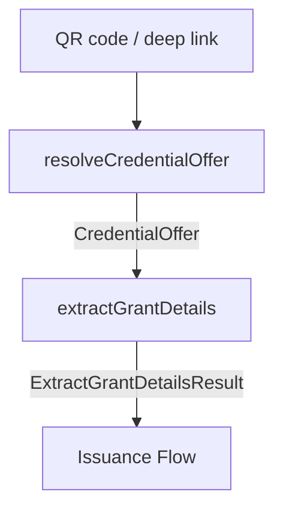

# Credential Offer

This module implements the **User Request Flow** for Issuer-Initiated credential issuance, as defined in [IT-Wallet Technical Specifications v1.3.3, Section 12.1.2](https://italia.github.io/eid-wallet-it-docs/) and [OpenID for Verifiable Credential Issuance 1.0, Section 4.1](https://openid.net/specs/openid-4-verifiable-credential-issuance-1_0.html#name-credential-offer-endpoint).

The flow processes a Credential Offer received from a Credential Issuer (or a Third Party / Authentic Source) and extracts the grant details needed to start the Issuance Flow.

All operations delegate to the [`@pagopa/io-wallet-oid4vci`](https://github.com/nicolo-ribaudo/io-wallet-oid4vci) SDK.

## Flow overview



| Step | Function | What it does |
|------|----------|--------------|
| 1 | `resolveCredentialOffer` | Parses the URI, fetches the offer if by-reference, validates structure |
| 2 | `extractGrantDetails` | Extracts the `authorization_code` grant details from the resolved offer |

## Credential Offer transmission

A Credential Offer can reach the Wallet Instance in two ways (OpenID4VCI Section 4.1):

### By value (`credential_offer`)

The complete Credential Offer JSON is embedded in the URI as an encoded query parameter:

```
openid-credential-offer://?credential_offer=%7B%22credential_issuer%22...%7D
```

### By reference (`credential_offer_uri`)

A URL points to a resource serving the Credential Offer. The Wallet fetches it via HTTP GET with `Accept: application/json`. The Credential Issuer or Third Party SHOULD use a unique URI per offer to prevent caching.

```
openid-credential-offer://?credential_offer_uri=https%3A%2F%2Fissuer.example.com%2Foffer
```

Both modes are handled transparently by `resolveCredentialOffer` (via the SDK).

## Supported URI schemes

The QR code or deep link must use one of the following schemes:

- `openid-credential-offer://` (OpenID4VCI Section 4)
- `haip-vci://` (OPENID4VC-HAIP Section 4.2)
- `https://` (Universal Link, if listed in the Wallet's `credential_offer_endpoint`)

## Step 1 — Resolve and validate

`resolveCredentialOffer(uri, { fetch })` performs two operations:

1. **Resolution** — parses the URI and, if the offer is by-reference, fetches the JSON from the remote endpoint.
2. **Structural validation** — checks the resolved offer against IT-Wallet v1.3 rules:
   - `credential_issuer` must be an HTTPS URL
   - `grants` object is required
   - `authorization_code` grant is required
   - `scope` is required within `authorization_code`

> **Note:** cross-validation against Credential Issuer metadata (e.g. verifying `credential_configuration_ids` against `credential_configurations_supported`, or matching `authorization_server` against the metadata's `authorization_servers`) is **not** part of this step. Per the spec, metadata processing happens once the User Request Flow is completed, at the start of the Issuance Flow.

## Step 2 — Extract grant details

`extractGrantDetails(offer)` reads the `grants` object and returns an `ExtractGrantDetailsResult`:

```ts
{
  grantType: "authorization_code",
  authorizationCodeGrant: {
    scope: string,             // REQUIRED — used in the Authorization Request
    issuerState?: string,      // binds the request to the Credential Issuer session
    authorizationServer?: string // REQUIRED when the issuer uses multiple AS
  }
}
```

IT-Wallet v1.3 only supports the `authorization_code` grant type.

## Credential Offer parameters

Reference: IT-Wallet spec, Section 12.1.2, Credential Offer parameters table.

| Field | Required | Description |
|-------|----------|-------------|
| `credential_issuer` | REQUIRED | HTTPS URL that uniquely identifies the Credential Issuer. Used to discover its metadata. |
| `credential_configuration_ids` | REQUIRED | Array of credential type identifiers. Each must match an entry in the Issuer's `credential_configurations_supported`. |
| `grants.authorization_code.scope` | REQUIRED | Maps to a specific credential type. The Wallet MUST use this value in the Authorization Request. |
| `grants.authorization_code.issuer_state` | OPTIONAL | Opaque string from the Issuer. When present the Wallet MUST include it in the Authorization Request. |
| `grants.authorization_code.authorization_server` | CONDITIONAL | REQUIRED when the Issuer uses more than one Authorization Server. Must match one entry in the Issuer's `authorization_servers` metadata. |

## Error mapping

| Error | Code | When |
|-------|------|------|
| `InvalidQRCodeError` | `ERR_INVALID_QR_CODE` | URI parsing or offer fetching fails (unsupported scheme, missing params, network error) |
| `InvalidCredentialOfferError` | `ERR_INVALID_CREDENTIAL_OFFER` | Structural validation fails (missing grant, missing scope, non-HTTPS issuer) or grant extraction fails |

## Boundary with the Issuance Flow

The Credential Offer flow ends once `extractGrantDetails` returns. The Issuance Flow then begins with:

1. Credential Issuer metadata processing (Trust Evaluation / Federation check)
2. Cross-validation of the offer against metadata
3. PAR Request, Authorization, Token exchange, Credential Request

## Examples

<details>
  <summary>Offer by reference</summary>

```ts
import { CredentialOffer } from "@pagopa/io-react-native-wallet";

const uri =
  "openid-credential-offer://?credential_offer_uri=https%3A%2F%2Fissuer.example.com%2Foffer";

// 1) Resolve — fetches the offer from the URI and validates it
const offer = await CredentialOffer.V1_3_3.resolveCredentialOffer(uri, {
  fetch: appFetch,
});

// 2) Extract grant details
const grant = CredentialOffer.V1_3_3.extractGrantDetails(offer);
// {
//   grantType: "authorization_code",
//   authorizationCodeGrant: { scope: "org.iso.18013.5.1.mDL", ... }
// }
```

</details>

<details>
  <summary>Offer by value</summary>

```ts
import { CredentialOffer } from "@pagopa/io-react-native-wallet";

const uri =
  "openid-credential-offer://?credential_offer=%7B%22credential_issuer%22%3A%22https%3A%2F%2Fissuer.example.com%22%2C%22credential_configuration_ids%22%3A%5B%22UniversityDegree%22%5D%2C%22grants%22%3A%7B%22authorization_code%22%3A%7B%22scope%22%3A%22UniversityDegree%22%7D%7D%7D";

// 1) Resolve — decodes the inline offer and validates it
const offer = await CredentialOffer.V1_3_3.resolveCredentialOffer(uri);

// 2) Extract grant details
const grant = CredentialOffer.V1_3_3.extractGrantDetails(offer);
```

</details>
