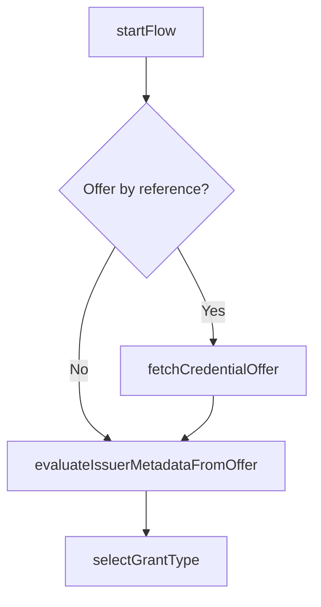

# Credential Offer

This flow handles the initial step of credential issuance by processing Credential Offers from Credential Issuers.
Each step in the flow is imported from the related file which is named with a sequential number.

A Credential Offer can be received by the Wallet in two ways:

- **by value**: complete offer embedded in the URL (`credential_offer` param)
- **by reference**: URL pointing to the offer endpoint (`credential_offer_uri` param)

The implementation follows the [OpenID for Verifiable Credential Issuance 1.0](https://openid.net/specs/openid-4-verifiable-credential-issuance-1_0.html#name-credential-offer-endpoint) specification.

## Sequence Diagram



## Supported schemes

The QR code / deep link must start with one of the supported schemes:

- `openid-credential-offer://`
- `haip://`
- `haip-vci://`

## Credential Offer transmission

### By value (`credential_offer`)

The complete Credential Offer is embedded in the URL parameter:

```
openid-credential-offer://?credential_offer=%7B%22credential_issuer%22...
```

In this case `startFlow` returns `{ credential_offer: CredentialOffer }`.

### By reference (`credential_offer_uri`)

A URL points to an endpoint serving the Credential Offer:

```
openid-credential-offer://?credential_offer_uri=https%3A%2F%2Fserver.example.com%2Foffer
```

In this case `startFlow` returns `{ credential_offer_uri: string }` and the Wallet fetches the offer via HTTP GET with `Accept: application/json`.

## Grant types

After obtaining the `CredentialOffer`, the Wallet selects the grant that will drive the following issuance flow.

This implementation supports:

### Pre-Authorized Code

Grant key:

- `urn:ietf:params:oauth:grant-type:pre-authorized_code`

Required fields:

- `pre-authorized_code`

Optional fields:

- `tx_code`

The selection result is normalized to:

- `{ type: "pre-authorized_code", "pre-authorized_code": string, tx_code?: TransactionCode }`

### Authorization Code

Grant key:

- `authorization_code`

Optional fields:

- `issuer_state`
- `authorization_server` (if missing, it defaults to the offer `credential_issuer`)

The selection result is normalized to:

- `{ type: "authorization_code", issuer_state?: string, authorization_server: string, scope: string }`

## Transaction Code requirements

When a transaction code is required for Pre-Authorized Code flow, the following parameters control the user experience:

| Parameter     | Type                    | Description                                       |
| ------------- | ----------------------- | ------------------------------------------------- |
| `input_mode`  | `"numeric"` \| `"text"` | Character set for the code (default: `"numeric"`) |
| `length`      | number                  | Expected code length to optimize input UI         |
| `description` | string                  | User guidance (max 300 chars) for obtaining code  |

## Mapped results

The following errors are raised during credential offer processing:

| Error                        | Code                       | Description                                                                 |
| --------------------------- | -------------------------- | --------------------------------------------------------------------------- |
| `InvalidQRCodeError`        | `ERR_INVALID_QR_CODE`       | The QR/deeplink is invalid or doesn't contain valid credential offer params |
| `InvalidCredentialOfferError` | `ERR_INVALID_CREDENTIAL_OFFER` | The credential offer validation failed or contains invalid data             |

## Examples

<details>
  <summary>Offer flow (by reference)</summary>

```ts
import { CredentialOffer } from "@pagopa/io-react-native-wallet";

const offerUrl =
  "openid-credential-offer://?credential_offer_uri=https%3A%2F%2Fissuer.example.com%2Foffer";

// 1) Parse QR code / deeplink
const params = CredentialOffer.V1_3_3.startFlow(offerUrl);

if (params.credential_offer_uri) {
  // 2) Fetch the offer
  const offer = await CredentialOffer.V1_3_3.fetchCredentialOffer(
    params.credential_offer_uri,
    { appFetch }
  );

  // 3) Fetch and validate issuer metadata (openid-credential-issuer)
  const { issuerConf } =
    await CredentialOffer.V1_3_3.evaluateIssuerMetadataFromOffer(offer, {
      appFetch,
    });

  // 4) Select the grant type
  const grant = CredentialOffer.V1_3_3.selectGrantType(offer);

  console.log({ issuerConf, grant });
}
```

</details>

<details>
  <summary>Offer flow (by value)</summary>

```ts
import {
  CredentialOffer,
  type CredentialOffer as CredentialOfferType,
} from "@pagopa/io-react-native-wallet";

const offerByValueUrl =
  "openid-credential-offer://?credential_offer=%7B%22credential_issuer%22%3A%22https%3A%2F%2Fissuer.example.com%22%2C%22credential_configuration_ids%22%3A%5B%22UniversityDegree%22%5D%2C%22grants%22%3A%7B%22authorization_code%22%3A%7B%22scope%22%3A%22UniversityDegree%22%7D%7D%7D";

const params = CredentialOffer.V1_3_3.startFlow(offerByValueUrl);

if (params.credential_offer) {
  const offer: CredentialOfferType = params.credential_offer;

  const { issuerConf } =
    await CredentialOffer.V1_3_3.evaluateIssuerMetadataFromOffer(offer, {
      appFetch,
    });

  const grant = CredentialOffer.V1_3_3.selectGrantType(offer);

  console.log({ issuerConf, grant });
}
```

</details>

<details>
  <summary>Pre-Authorized Code with Transaction Code</summary>

```ts
import {
  CredentialOffer,
  type CredentialOffer as CredentialOfferType,
} from "@pagopa/io-react-native-wallet";

const offer: CredentialOfferType = {
  credential_issuer: "https://university.example.edu",
  credential_configuration_ids: ["DiplomaCredential"],
  grants: {
    "urn:ietf:params:oauth:grant-type:pre-authorized_code": {
      "pre-authorized_code": "SplxlOBeZQQYbYS6WxSbIA",
      tx_code: {
        length: 4,
        input_mode: "numeric",
        description: "Check your email for the verification code",
      },
    },
  },
};

const grant = CredentialOffer.V1_3_3.selectGrantType(offer);

// grant.type === "pre-authorized_code"
// grant["pre-authorized_code"] is the code to be used in the token request
// grant.tx_code describes how to ask the user for the transaction code
console.log(grant);
```

</details>

<details>
  <summary>Authorization Code (authorization_server default)</summary>

```ts
import {
  CredentialOffer,
  type CredentialOffer as CredentialOfferType,
} from "@pagopa/io-react-native-wallet";

const offer: CredentialOfferType = {
  credential_issuer: "https://issuer.example.com",
  credential_configuration_ids: ["org.iso.18013.5.1.mDL"],
  grants: {
    authorization_code: {
      issuer_state: "af0ifjsldkj",
      // if omitted, it will default to credential_issuer
      scope: "org.iso.18013.5.1.mDL",
    },
  },
};

const grant = CredentialOffer.V1_3_3.selectGrantType(offer);

// grant.authorization_server === "https://issuer.example.com"
console.log(grant);
```

</details>
