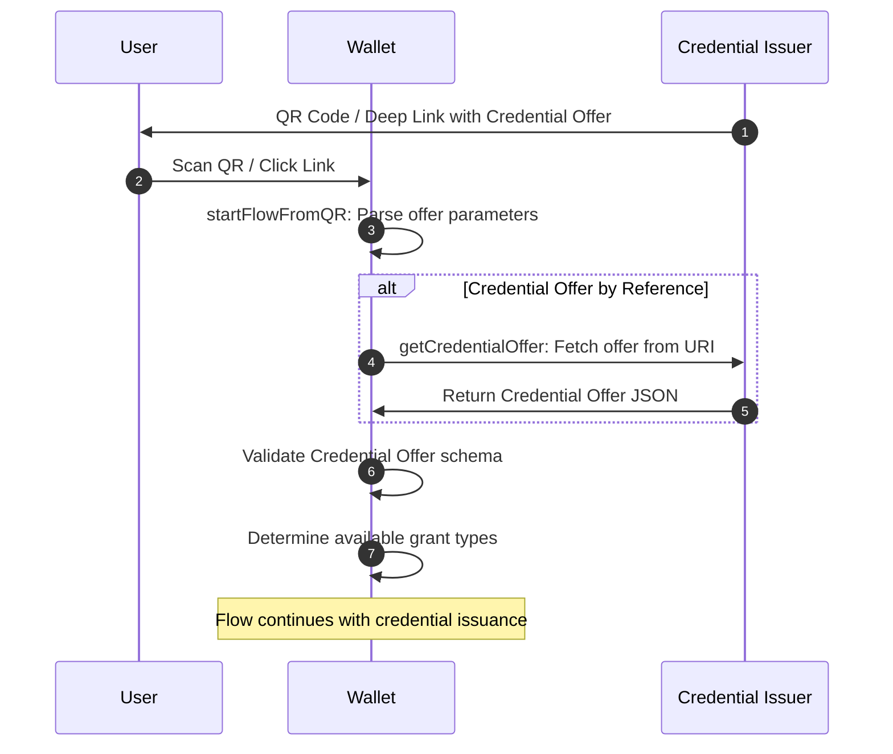

# Credential Offer

This flow handles the initial step of credential issuance by processing Credential Offers from Credential Issuers. The Credential Offer contains information about what credentials are available and how they can be obtained. Each step in the flow is imported from the related file which is named with a sequential number.

A Credential Offer can be received by the Wallet in two ways: **by value** (complete offer embedded in the URL) or **by reference** (URL pointing to the offer endpoint). The offer specifies which credentials are available and what authorization flows are supported by the issuer.

The implementation follows the [OpenID for Verifiable Credential Issuance 1.0](https://openid.net/specs/openid-4-verifiable-credential-issuance-1_0.html#name-credential-offer-endpoint) specification and supports both Authorization Code flow and Pre-Authorized Code flow.

## Sequence Diagram



## Grant Types

The Credential Offer supports two OAuth 2.0 grant types that determine how authorization is handled:

### Authorization Code Flow

Used for interactive flows where user authentication and consent are required at the Authorization Server.

- **`issuer_state`** (optional): Binds the authorization request to a specific issuer context
- **`authorization_server`** (optional): Identifies which authorization server to use when multiple are available

### Pre-Authorized Code Flow  

Used when the user has already been authenticated and authorized out-of-band. The issuer provides a pre-authorized code that can be exchanged directly for credentials.

- **`pre-authorized_code`**: Short-lived single-use authorization code
- **`tx_code`** (optional): Additional transaction code requirements for security
- **`authorization_server`** (optional): Identifies which authorization server to use

## Transaction Code Requirements

When a transaction code is required for Pre-Authorized Code flow, the following parameters control the user experience:

| Parameter | Type | Description |
|-----------|------|-------------|
| `input_mode` | `"numeric"` \| `"text"` | Character set for the code (default: `"numeric"`) |
| `length` | number | Expected code length to optimize input UI |
| `description` | string | User guidance (max 300 chars) for obtaining the code |

## Credential Offer Transmission

### By Value
The complete Credential Offer is embedded in the URL parameter:
```
openid-credential-offer://?credential_offer=%7B%22credential_issuer%22...
```

### By Reference  
A URL points to an endpoint serving the Credential Offer:
```
openid-credential-offer://?credential_offer_uri=https%3A%2F%2Fserver.example.com%2Foffer
```

When using by reference, the Wallet fetches the offer via HTTP GET with `Accept: application/json`.

## Mapped Results

The following errors are mapped during credential offer processing:

| Error | Description |
|-------|-------------|
| `InvalidQRCodeError` | The QR code format is invalid or doesn't contain valid credential offer parameters |
| `InvalidCredentialOfferError` | The credential offer schema validation failed or contains invalid data |

## Examples

<details>
  <summary>Credential Offer processing flow</summary>

```ts
// Parse QR code or deep link
const qrCode = "openid-credential-offer://?credential_offer_uri=https%3A%2F%2Fissuer.example.com%2Foffer";
const { credential_offer_uri } = startFlowFromQR(qrCode);

// Fetch the credential offer if by reference
const offer = await getCredentialOffer(credential_offer_uri, { appFetch });

console.log(offer);
// {
//   credential_issuer: "https://issuer.example.com",
//   credential_configuration_ids: ["UniversityDegree", "DriverLicense"], 
//   grants: {
//     authorization_code: {
//       issuer_state: "xyz123"
//     },
//     "urn:ietf:params:oauth:grant-type:pre-authorized_code": {
//       "pre-authorized_code": "SplxlOBeZQQYbYS6WxSbIA",
//       tx_code: {
//         length: 6,
//         input_mode: "numeric",
//         description: "Enter the code sent to your email"
//       }
//     }
//   }
// }
```

</details>

<details>
  <summary>Pre-Authorized Code with Transaction Code</summary>

```ts
const offer: CredentialOffer = {
  credential_issuer: "https://university.example.edu",
  credential_configuration_ids: ["DiplomaCredential"],
  grants: {
    "urn:ietf:params:oauth:grant-type:pre-authorized_code": {
      "pre-authorized_code": "eyJhbGciOiJIUzI1NiIsInR5cCI6IkpXVCJ9",
      tx_code: {
        length: 4,
        input_mode: "numeric", 
        description: "Check your email for the verification code"
      }
    }
  }
};

// The user would need to:
// 1. Check their email for a 4-digit numeric code
// 2. Enter it in the wallet when prompted
// 3. The wallet uses both pre-authorized_code and tx_code in the token request
```

</details>

<details>
  <summary>Authorization Code Flow</summary>

```ts
const offer: CredentialOffer = {
  credential_issuer: "https://dmv.example.gov",
  credential_configuration_ids: ["org.iso.18013.5.1.mDL"],
  grants: {
    authorization_code: {
      issuer_state: "af0ifjsldkj", 
      authorization_server: "https://auth.dmv.example.gov"
    }
  }
};

// This would lead to:
// 1. User authentication at the authorization server
// 2. User consent for credential issuance  
// 3. Authorization code returned to wallet
// 4. Wallet exchanges code for access token
// 5. Wallet uses access token to request credential
```

</details>
