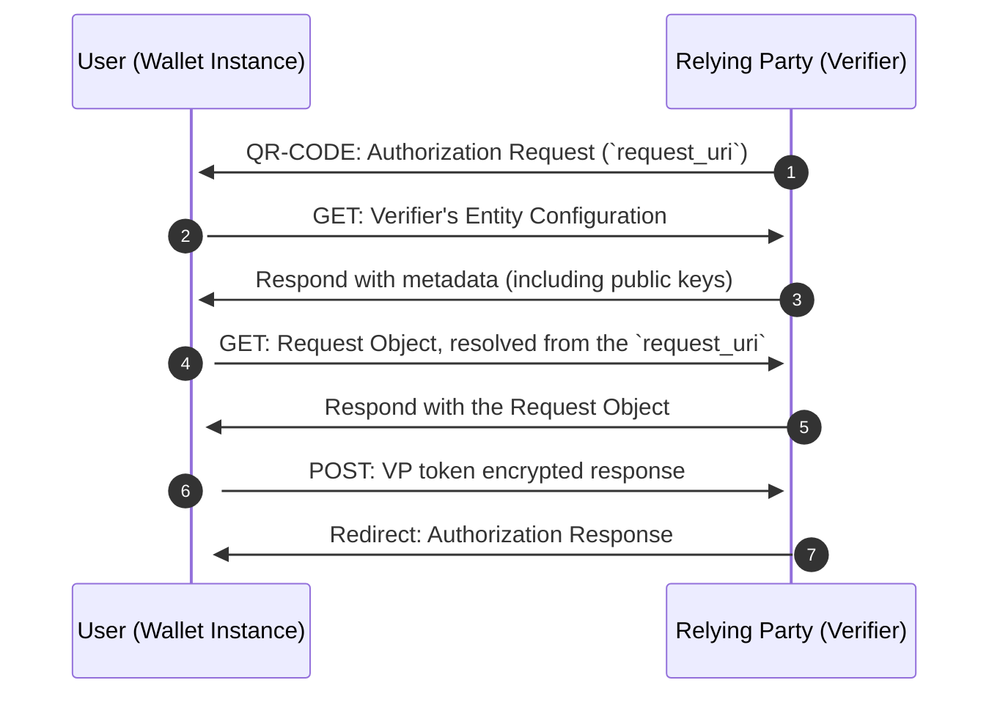

# Credential Presentation

This flow is used for remote presentation, allowing a user with a valid Wallet Instance to remotely present credentials to a Relying Party (Verifier). The presentation flow adheres to the [IT Wallet 0.9.x specification](https://italia.github.io/eid-wallet-it-docs/v0.9.3/en/relying-party-solution.html).

The Relying Party provides the Wallet with a Request Object that contains the requested credentials and claims. The Wallet validates the Request Object and asks the user for consent. Then the Wallet creates an encrypted Authorization Response that contains the Verifiable Presentation with the requested data (`vp_token`) and sends it to the Relying Party.

## Sequence Diagram




## Examples

<details>
  <summary>Remote Presentation flow</summary>

```ts
// Scan e retrive qr-code, decode it and get its parameters
const qrCodeParams = decodeQrCode(qrCode)

// Retrieve the integrity key tag from the store and create its context
const integrityKeyTag = "example"; // Let's assume this is the key tag used to create the wallet instance
const integrityContext = getIntegrityContext(integrityKeyTag);

// Let's assume the key esists befor starting the presentation process
const wiaCryptoContext = createCryptoContextFor(WIA_KEYTAG);

// Let's assume these are the environment variables
const { WALLET_PROVIDER_BASE_URL, WALLET_EAA_PROVIDER_BASE_URL, REDIRECT_URI } = env;

/**
 * Obtains a new Wallet Instance Attestation.
 * WARNING: The integrity context must be the same used when creating the Wallet Instance with the same keytag.
 */
const walletInstanceAttestation =
  await WalletInstanceAttestation.getAttestation({
    wiaCryptoContext,
    integrityContext,
    walletProviderBaseUrl: WALLET_PROVIDER_BASE_URL,
    appFetch,
  });

// Start the issuance flow
const {
  requestURI,
  clientId,
  requestUriMethod,
  state
} = Credential.Presentation.startFlowFromQR(qrCodeParams);

// Get Relying Party's Entity Configuration and evaluate trust
const { rpConf } = await Credential.Presentation.evaluateRelyingPartyTrust(clientId);

// Get the Request Object from the RP
const { requestObjectEncodedJwt } =
  await Credential.Presentation.getRequestObject(requestUri);

// Validate the Request Object
const { requestObject } = await Credential.Presentation.verifyRequestObject(
  requestObjectEncodedJwt,
  { clientId, rpConf }
);

// All the credentials that might be requested by the Relying Party
const credentialsSdJwt = [
  ["credential1_keytag", "credential1_sd-jwt"],
  ["credential2_keytag", "credential2_sd-jwt"],
]

const result = Credential.Presentation.evaluateDcqlQuery(
  credentialsSdJwt,
  requestObject.dcql_query as DcqlQuery
);

const credentialsToPresent = result.map(
  ({ requiredDisclosures, ...rest }) => ({
    ...rest,
    requestedClaims: requiredDisclosures.map(([, claimName]) => claimName),
  })
);

const remotePresentations =
  await Credential.Presentation.prepareRemotePresentations(
    credentialsToPresent,
    requestObject.nonce,
    requestObject.client_id
  );

const authResponse = await Credential.Presentation.sendAuthorizationResponse(
  requestObject,
  remotePresentations,
  rpConf
);
```

</details>