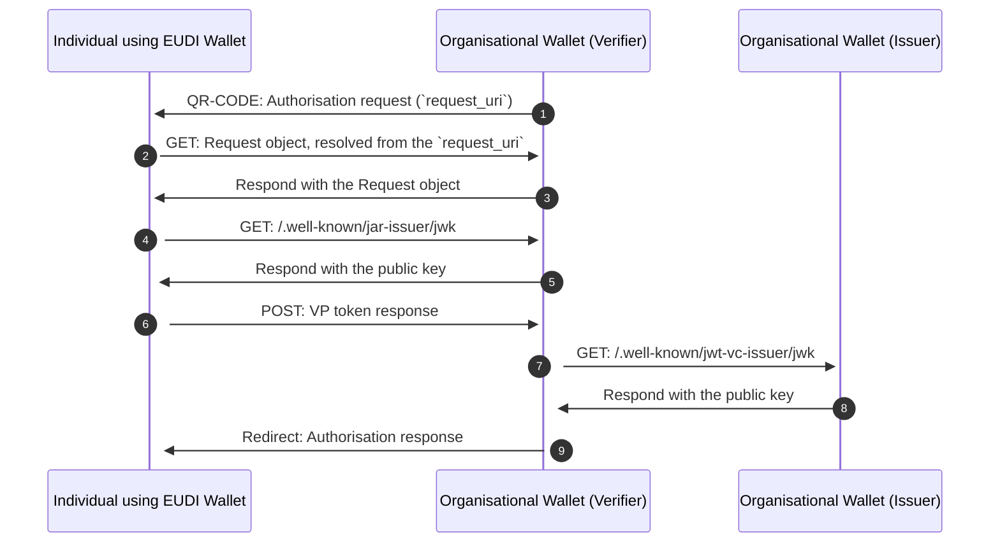

# Credential Presentation

## Sequence Diagram



## Mapped results

## Examples

<details>
  <summary>Remote Presentation flow</summary>

```ts
// Scan e retrive qr-code, decode it and get its parameters
const {requestUri, clientId} = ...

// Retrieve the integrity key tag from the store and create its context
const integrityKeyTag = "example"; // Let's assume this is the key tag used to create the wallet instance
const integrityContext = getIntegrityContext(integrityKeyTag);

// Let's assume the key esists befor starting the presentation process
const wiaCryptoContext = createCryptoContextFor(WIA_KEYTAG);

const { WALLET_PROVIDER_BASE_URL, WALLET_EAA_PROVIDER_BASE_URL, REDIRECT_URI } =
  env; // Let's assume these are the environment variables

/**
 * Obtains a new Wallet Instance Attestation.
 * WARNING: The integrity context must be the same used when creating the Wallet Instance with the same keytag.
 */
const walletInstanceAttestation =
  await WalletInstanceAttestation.getAttestation({
    wiaCryptoContext,
    integrityContext,
    walletProviderBaseUrl: WALLET_PROVIDER_BASE_URL,
    appFetch,
  });

// Start the issuance flow
const { requestURI, clientId } = Credential.Presentation.startFlowFromQR(requestUri, clientId);

// If use trust federation: Evaluate issuer trust
const { rpConf } = await Credential.Presentation.evaluateRelyingPartyTrust(clientId);

const { requestObjectEncodedJwt } =
    await Credential.Presentation.getRequestObject(requestURI, {
      appFetch: appFetch
    });

// Retrieve RP JWK
// If use trust federation: Fetch Jwks from rpConf
const jwks = await Credential.Presentation.fetchJwksFromConfig(rpConf);

// If not use trust: Fetch Jwks from request object
const jwks = await Credential.Presentation.fetchJwksFromRequestObject(
  requestObjectEncodedJwt,
  { context: { appFetch } }
);

// Verify signature Request Object
const { requestObject } =
    await Credential.Presentation.verifyRequestObjectSignature(
      requestObjectEncodedJwt,
      jwks.keys
    );


const { presentationDefinition } = await Credential.Presentation.fetchPresentDefinition(
  requestObject,
  {
    appFetch: appFetch,
  },
  rpConf // If trust federation is used
);

// For each credential, find it and evaluate input descriptor and disclosures
  const { requiredDisclosures } = Credential.Presentation.evaluateInputDescriptionForSdJwt4VC(
    inputDescriptor,
    credential.payload,
    disclosures
  );

// After confirm disclosures in app
  const authResponse = Credential.Presentation.sendAuthorizationResponse(
    requestObject,
    presentationDefinition,
    jwks,
    [credential, disclosuresRequested, { appFetch: appFetch }]
  );


```

</details>
