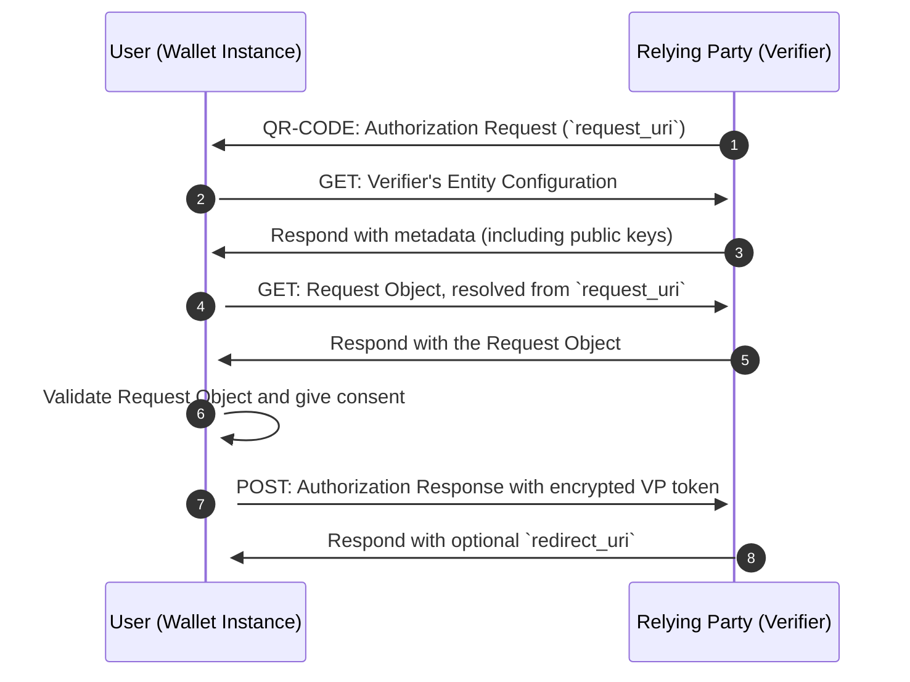

# Credential Presentation

This flow is used for remote presentation, allowing a user with a valid Wallet Instance to remotely present credentials to a Relying Party (Verifier). The presentation flow adheres to the [IT Wallet 0.9.x specification](https://italia.github.io/eid-wallet-it-docs/v0.9.3/en/relying-party-solution.html).

The Relying Party provides the Wallet with a Request Object that contains the requested credentials and claims. The Wallet validates the Request Object and asks the user for consent. Then the Wallet creates an encrypted Authorization Response that contains the Verifiable Presentation with the requested data (`vp_token`) and sends it to the Relying Party.

## Sequence Diagram



## Mapped results

| Error                       | Description|
| --------------------------- | ------------------------------------------------------------------------------------------------------------------------------------------------------ |
| `ValidationFailed`          | The presentation request is not valid, for instance the DCQL query is invalid.                                                                         |
| `CredentialsNotFoundError`  | The presentation cannot be completed because the Wallet does not contain all requested credentials. The missing credentials can be found in `details`. |
| `RelyingPartyResponseError` | Error in the Relying Party's response. See the next table for more details.                                                                            |

The following HTTP errors are mapped to a `RelyingPartyResponseError` with specific codes.

| HTTP Status  | Error Code                              | Description                                                                                                  |
| ------------ | --------------------------------------- | ------------------------------------------------------------------------------------------------------------ |
| `400`, `403` | `ERR_RP_INVALID_AUTHORIZATION_RESPONSE` | The Relying Party rejected the Authorization Response sent by the Wallet because it was deemed invalid.      |
| `*`          | `ERR_RP_GENERIC_ERROR`                  | This is a generic error code to map unexpected errors that occurred when interacting with the Relying Party. |


## Examples

<details>
  <summary>Remote Presentation flow</summary>

**Note:** To successfully complete a remote presentation, the Wallet Instance must be in a valid state with a valid Wallet Instance Attestation.

```ts
// Retrieve and scan the qr-code, decode it and get its parameters
const qrCodeParams = decodeQrCode(qrCode)

// Start the issuance flow
const {
  request_uri,
  client_id,
  request_uri_method,
  state
} = Credential.Presentation.startFlowFromQR(qrCodeParams);

// Get the Relying Party's Entity Configuration and evaluate trust
const { rpConf } = await Credential.Presentation.evaluateRelyingPartyTrust(client_id);

// Get the Request Object from the RP
const { requestObjectEncodedJwt } =
  await Credential.Presentation.getRequestObject(request_uri);

// Validate the Request Object
const { requestObject } = await Credential.Presentation.verifyRequestObject(
  requestObjectEncodedJwt,
  { clientId: client_id, rpConf }
);

// All the credentials that might be requested by the Relying Party
const credentialsSdJwt = [
  ["credential1_keytag", "eyJraWQiOiItRl82VWdhOG4zVmVnalkyVTdZVUhLMXpMb2FELU5QVGM2M1JNSVNuTGF3IiwidHlwIjoidmMrc2Qtand0IiwiYWxnIjoiRVMyNTYifQ.eyJfc2"],
  ["credential2_keytag", "eyJ0eXAiOiJ2YytzZC1qd3QiLCJhbGciOiJFUzI1NiIsImtpZCI6Ii1GXzZVZ2E4bjNWZWdqWTJVN1lVSEsxekxvYUQtTlBUYzYzUk1JU25MYXcifQ.ew0KIC"]
];

const result = Credential.Presentation.evaluateDcqlQuery(
  credentialsSdJwt,
  requestObject.dcql_query as DcqlQuery
);

const credentialsToPresent = result.map(
  ({ requiredDisclosures, ...rest }) => ({
    ...rest,
    requestedClaims: requiredDisclosures.map(([, claimName]) => claimName),
  })
);

const remotePresentations =
  await Credential.Presentation.prepareRemotePresentations(
    credentialsToPresent,
    requestObject.nonce,
    requestObject.client_id
  );

const authResponse = await Credential.Presentation.sendAuthorizationResponse(
  requestObject,
  remotePresentations,
  rpConf
);
```

</details>