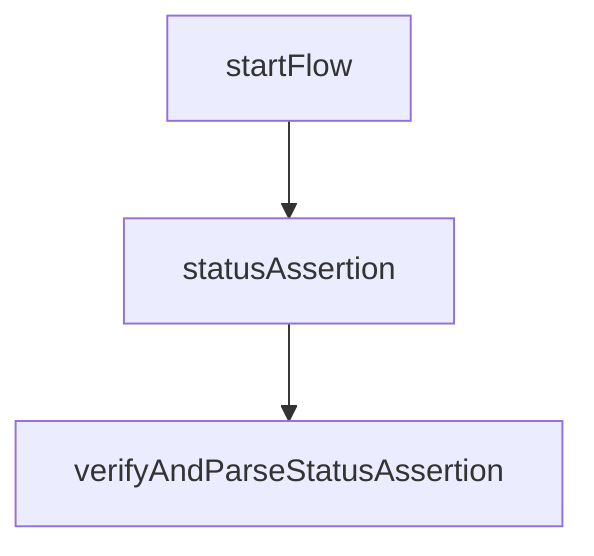

# Credential Status Assertion

This flow is used to obtain a credential status assertion from its credential issuer. Each step in the flow is imported from the related file which is named with a sequential number.
The credential status assertion is a JWT which contains the credential status which indicates if the credential is valid or not (see [OAuth Status Assertions](https://italia.github.io/eid-wallet-it-docs/versione-corrente/en/credential-revocation.html#oauth-status-assertions)).
The status assertion is supposed to be stored securely along with the credential. It has a limited lifetime and should be refreshed periodically according to the `exp` field in the JWT payload.

## Sequence Diagram




## Mapped results

The following errors are mapped to a `IssuerResponseError` with specific codes.

|Error Code|Description|
|----------|-----------|
|`ERR_CREDENTIAL_INVALID_STATUS`|This error is thrown when the status assertion for a given credential is invalid. It might contain more details in the `reason` property.|

## Example

<details>
  <summary>Credential status assertion flow</summary>

```ts
import { IoWallet } from "@pagopa/io-react-native-wallet";

const wallet = new IoWallet({ version: "1.0.0" });

// Start the issuance flow
const credentialIssuerUrl = "https://issuer.example.com";
const startFlow: Credential.Status.StartFlow = () => ({
  issuerUrl: credentialIssuerUrl, // Let's assum
});

const { issuerUrl } = startFlow();

// Evaluate issuer trust
const { issuerConf } = await wallet.CredentialIssuance.evaluateIssuerTrust(issuerUrl);

// Get the credential assertion
const res = await wallet.CredentialStatus.statusAssertion(
  issuerConf,
  credential,
  format,
  { credentialCryptoContext, wiaCryptoContext }
);

// Verify and parse the status assertion
const { parsedStatusAssertion } =
  await wallet.CredentialStatus.verifyAndParseStatusAssertion(
    issuerConf,
    res.statusAssertion,
    credential,
    format
  );

return {
  statusAssertion: res.statusAssertion,
  parsedStatusAssertion,
};
```

</details>
