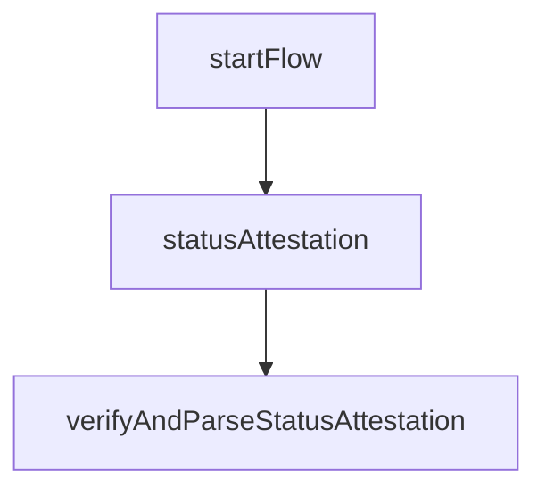

# Credential Status Attestation

This flow is used to obtain a credential status attestation from its credential issuer. Each step in the flow is imported from the related file which is named with a sequential number.
The credential status attestation is a JWT which contains the credential status which indicates if the credential is valid or not.
The status attestation is supposed to be stored securely along with the credential. It has a limited lifetime and should be refreshed periodically according to the `exp` field in the JWT payload.

## Sequence Diagram



## Mapped results

The following errors are mapped to a `IssuerResponseError` with specific codes.

| HTTP Status     | Error Code                      | Description                                                                                                                                        |
| --------------- | ------------------------------- | -------------------------------------------------------------------------------------------------------------------------------------------------- |
| `404 Not Found` | `ERR_CREDENTIAL_INVALID_STATUS` | This response is returned by the credential issuer when the status attestation is invalid. It might contain more details in the `reason` property. |

## Example

<details>
  <summary>Credential status attestation flow</summary>

```ts
// Start the issuance flow
const credentialIssuerUrl = "https://issuer.example.com";
const startFlow: Credential.Status.StartFlow = () => ({
  issuerUrl: credentialIssuerUrl, // Let's assum
});

const { issuerUrl } = startFlow();

// Evaluate issuer trust
const { issuerConf } = await Credential.Status.getIssuerConfig(issuerUrl);

// Get the credential attestation
const res = await Credential.Status.statusAttestation(
  issuerConf,
  credential,
  credentialCryptoContext
);

// Verify and parse the status attestation
const { parsedStatusAttestation } =
  await Credential.Status.verifyAndParseStatusAttestation(
    issuerConf,
    res.statusAttestation,
    { credentialCryptoContext }
  );

return {
  statusAttestation: res.statusAttestation,
  parsedStatusAttestation,
  credentialType,
};
```

</details>
