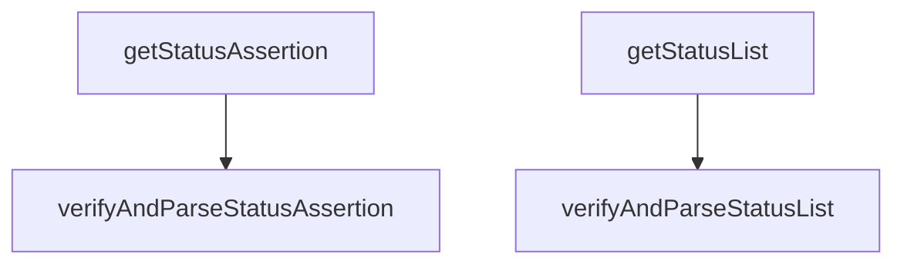

# Credential Status

This flow is used to obtain the credential status from its credential issuer. The following methods are currently supported:
- Status Assertion (v1.0.0)
- Token Status List (v1.3.3)

Each step in the flow is imported from the related file which is named with a sequential number.

#### Status assertion
The credential status assertion is a JWT which contains the credential status which indicates if the credential is valid or not (see [OAuth Status Assertions](https://italia.github.io/eid-wallet-it-docs/versione-corrente/en/credential-revocation.html#oauth-status-assertions)).
The status assertion is supposed to be stored securely along with the credential. It has a limited lifetime and should be refreshed periodically according to the `exp` field in the JWT payload.

#### Status list
The status list is a byte array embedded in a JWT/CWT, where a sequence of bits is used to represent the status of a digital credential. Each credential references the status list it is part of and the index to access its status. The following is an example for a SD-JWT credential:
```json
{
  "status": {
    "status_list": {
      "idx": 1000,
      "uri": "https://status-list.issuer.example"
    }
  }
}
```

## Sequence Diagram


```mermaid
graph TD;
  0[getStatusAssertion]
  1[verifyAndParseStatusAssertion]
  2[getStatusList]
  3[verifyAndParseStatusList]
  0 --> 1
  2 --> 3
```

## Mapped results

The following errors are mapped to a `IssuerResponseError` with specific codes.

|Error Code|Description|
|----------|-----------|
|`ERR_CREDENTIAL_INVALID_STATUS`|This error is thrown when the status assertion for a given credential is invalid. It might contain more details in the `reason` property.|

## Example

The status assertion and list APIs are exposed under the namespaces `statusAssertion` and `statusList` respectively, and before using them it necessary to ensure they are supported:
```ts
if (CredentialStatus.statusAssertion.isSupported) {
  // Safely invoke status assertion APIs...
}
if (CredentialStatus.statusList.isSupported) {
  // Safely invoke status list APIs...
}
```

<details>
  <summary>Credential status assertion flow</summary>

```ts
import { IoWallet } from "@pagopa/io-react-native-wallet";

const wallet = new IoWallet({ version: "1.0.0" });

const credentialIssuerUrl = "https://issuer.example.com";

const { issuerConf } = await wallet.CredentialIssuance.evaluateIssuerTrust(credentialIssuerUrl);

// Get the credential assertion
const res = await wallet.CredentialStatus.statusAssertion.get(
  issuerConf,
  credential,
  format,
  { credentialCryptoContext, wiaCryptoContext }
);

// Verify and parse the status assertion
const { parsedStatusAssertion } =
  await wallet.CredentialStatus.statusAssertion.verifyAndParse(
    issuerConf,
    res.statusAssertion,
    credential,
    format
  );

return {
  statusAssertion: res.statusAssertion,
  parsedStatusAssertion,
};
```

</details>

<details>
  <summary>Credential status list flow</summary>

```ts
import { IoWallet } from "@pagopa/io-react-native-wallet";

const wallet = new IoWallet({ version: "1.3.3" });

const credentialIssuerUrl = "https://issuer.example.com";

const { issuerConf } = await wallet.CredentialIssuance.evaluateIssuerTrust(credentialIssuerUrl);

// Get the status list
const res = await wallet.CredentialStatus.statusList.get(
  credential,
  format,
);

// Verify and parse the status list response to get the credential status
const { status } =
  await wallet.CredentialStatus.statusList.verifyAndParse(
    issuerConf,
    res
  );

return {
  statusList: res.statusList,
  status,
};
```

</details>