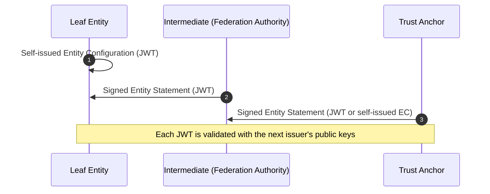

# Trust Chain Validation

This module implements **Trust Chain validation** for Entity Configurations and Entity Statements in line with the [IT Wallet Federation Specifications](https://italia.github.io/eid-wallet-it-docs/). It ensures that an entity's metadata is trusted by validating a chain of signed JWTs up to a known Trust Anchor.

The validation covers:

* JWT signature verification (using the next entity's JWKS)
* Trust chain ordering (leaf → parent → Trust Anchor)
* Optional X.509 CRL-based certificate validation

## Sequence Diagram



## Errors

| Error                         | Description                                                        |
| ----------------------------- | ------------------------------------------------------------------ |
| `TrustChainEmptyError`        | The input chain is empty.                                          |
| `TrustChainTokenMissingError` | One of the JWTs in the chain is missing.                           |
| `X509ValidationError`         | X.509 certificate validation failed (e.g. revocation, expiration). |
| `FederationError`             | Generic federation processing error.                               |

## Usage

### Validate a trust chain

```ts
import { IoWallet } from "@pagopa/io-react-native-wallet";
import { trustAnchorEntityConfiguration } from "./your-data";
import { chain } from "./your-data"; // array of JWTs, starting from leaf

const wallet = new IoWallet({ version: "1.0.0" });

const result = await wallet.Trust.verifyTrustChain(
  trustAnchorEntityConfiguration, 
  chain, 
  {
    connectTimeout: 3000,
    readTimeout: 3000,
    requireCrl: false,
  },
  {
    renewOnFail: true // Optional trust chain renewal
  }
);
```

* The `chain` must be an array of signed JWT strings.
* The first JWT must be a self-issued `EntityConfiguration`.
* The last JWT must be an `EntityStatement` or a self-issued Trust Anchor `EntityConfiguration`.

### Renew a trust chain

[>!NOTE]
> Internal only

```ts
import { renewTrustChain } from "./trust";

const newChain = await renewTrustChain(chain);
```

This will fetch updated JWTs from each authority in the chain.

### Build a trust chain

```ts
import { IoWallet } from "@pagopa/io-react-native-wallet";

const wallet = new IoWallet({ version: "1.0.0" });

const chain = await wallet.Trust.buildTrustChain({
  leaf: "https://example-leaf",
  trustAnchor: trustAnchorEntityConfiguration,
});
```

* **leaf**: the entity URL of the subject to be trusted.
* **trustAnchor**: the known trust anchor configuration.
* Returns a list of JWT strings ordered from leaf to trust anchor.


## Trust Chain Structure

| Position | JWT Type                            | Requirements                  |
| -------- | ----------------------------------- |-------------------------------|
| First    | Entity Configuration                | `iss === sub` (self-issued)   |
| Middle   | Entity Statement                    | `iss ≠ sub`, signed by parent |
| Last     | Entity Statement or Trust Anchor EC | Trust Anchor must be known    |

### Build and Validate Example

```ts
import { IoWallet } from "@pagopa/io-react-native-wallet";
import { trustAnchorEntityConfiguration } from "./your-data";

const wallet = new IoWallet({ version: "1.0.0" });

const chain = await wallet.Trust.buildTrustChain({
  leaf: "https://example-leaf",
  trustAnchor: trustAnchorEntityConfiguration,
});

const result = await wallet.Trust.verifyTrustChain(trustAnchorEntityConfiguration, chain, {
  connectTimeout: 3000,
  readTimeout: 3000,
  requireCrl: true,
});
```

* This example fetches and builds the full trust chain dynamically, then validates it end-to-end.

## Example Trust Chain

```ts
[
    {
        header: { alg: "ES256", kid: "leaf-kid" },
        payload: { iss: "https://leaf", sub: "https://leaf", jwks: { keys: [...] } }
    },
    {
        header: { alg: "ES256", kid: "intermediate-kid" },
        payload: { iss: "https://intermediate", sub: "https://leaf", jwks: { keys: [...] } }
    },
    {
        header: { alg: "ES256", kid: "ta-kid" },
        payload: { iss: "https://ta", sub: "https://ta", jwks: { keys: [...] } }
    }
]
```

## Mocking in Tests

If you're testing in Node (not in React Native), you need to mock X.509 and crypto-native dependencies:

```ts
jest.mock("@pagopa/io-react-native-crypto", () => ({
    verifyCertificateChain: jest.fn().mockResolvedValue({
        isValid: true,
        validationStatus: "VALID",
        errorMessage: undefined,
    }),
    generate: jest.fn().mockResolvedValue({ ... }),
}));
```

Ensure mocked `JWK`s contain an `x5c` array to trigger certificate validation logic during tests.
